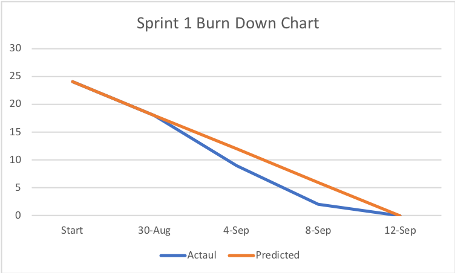

# Sprint 1 Deliverables
[Vision Statement](../README.md#escala)  

User Stories  
------------  
| User Stories | Validation | Priority | Story Points |
|--------------|------------|----------|--------------|
| I want to be able to change the resolution of the game. | User sees resolution change. | 5 | 2 |
| I want to be able to change the difficulty of the game. | User has different experience at different difficulties. | 5 | 21 |
| I want to be able to select different products for the the game. | User has different experience with different products. | 5 | 3 |
| I want to be able to pause the game on click or when I open a menu. | Game pauses. | 2 | 2 |
| I want to be able to change the speed of the game. | Game changes speed. | 3 | 3 |
| I want the software to load at the center of my screen. | Game starts at the center of the screen. | 1 | 1 |
| I want to be able to change the settings before starting the game. | Settings menu has effect on game. | 3 | 8 |
| I want the graphics to change when I hover over a region. | Game regions change on color. | 1 | 8 |
| I want to see a demo before playing the game. | User is taught how to play the game prior to starting. | 5 | 21 |
| I want to be able to click on the map, and see the effects of my click. | User see change on click. | 1 | 13 |
| I want the game to continue without having to click a button. | Automatic game progression. | 1 | 3 |
| I want to be able to upgrade my product, marketing and logistics. | User can change company stats. | 1 | 21 |
| I want to see my product being shipped across the globe. | Sprites move across globe. | 5 | 5 |
| I want the game to have some randomness, so I can't play the same game twice. | Randomness occurs throught the game. | 4 | 8 |
| I want to see my stats without having to enter a separate menu. | Stats are displayed on the map. | 1 | 3 |
| I want to be able to change my game settings mid-game. | Settings tweaks take effect. | 5 | 21 |
| I want to be able to name my product, and see it used in the game. | Product name is used throughout the game. | 5 | 5 |
| I want to be able to save my game and reload it. | Game can be reloaded. | 5 | 8 |
| I want each region to have immersive data. | User sees region data in-game. | 5 | 8 |

Backlogs  
--------  
[Product Backlog](https://github.com/tgsachse/escala/issues?utf8=%E2%9C%93&q=is%3Aissue+label%3A%22product+backlog%22+)  
[Sprint Backlog](https://github.com/tgsachse/escala/issues?utf8=%E2%9C%93&q=is%3Aissue+label%3A%22sprint+1+backlog%22+)  

Burn Down Chart  
---------------  

UML Diagram  
-----------  
placeholder

Code  
----  
placeholder
